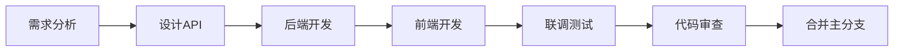

# 开发者指南 - 车险签单数据分析平台 v2.0

> 完整的开发文档，包含环境搭建、API参考、开发规范、故障排查

**目标读者**: 前端开发、后端开发、全栈开发
**预计阅读时间**: 30分钟
**最后更新**: 2025-11-08

---

## 📖 目录

- [快速开始](#快速开始)
- [开发环境](#开发环境)
- [项目结构](#项目结构)
- [开发流程](#开发流程)
- [API参考](#api参考)
- [组件开发](#组件开发)
- [状态管理](#状态管理)
- [样式规范](#样式规范)
- [测试指南](#测试指南)
- [部署指南](#部署指南)
- [故障排查](#故障排查)
- [迁移指南](#迁移指南)

---

## 🚀 快速开始

### TL;DR (30秒速览)

```bash
# 克隆项目
git clone <repo-url> && cd daylyreport

# 启动前端 (终端1)
npm install && npm run dev

# 启动后端 (终端2)
pip install -r requirements.txt
cd backend && python api_server.py

# 访问 http://localhost:3000
```

### 前置要求

| 工具 | 版本 | 检查命令 | 安装指南 |
|------|------|---------|---------|
| **Node.js** | 18+ | `node -v` | [nodejs.org](https://nodejs.org/) |
| **Python** | 3.11+ | `python --version` | [python.org](https://www.python.org/) |
| **Git** | 2.0+ | `git --version` | [git-scm.com](https://git-scm.com/) |
| **VS Code** | 最新 | - | [code.visualstudio.com](https://code.visualstudio.com/) |

---

## 🛠️ 开发环境

### 1. 安装依赖

#### 前端依赖
```bash
cd daylyreport
npm install

# 国内镜像加速
npm install --registry=https://registry.npmmirror.com
```

#### 后端依赖
```bash
# 创建虚拟环境（推荐）
python -m venv .venv
source .venv/bin/activate  # macOS/Linux
.venv\Scripts\activate     # Windows

# 安装依赖
pip install -r requirements.txt

# 国内镜像加速
pip install -r requirements.txt -i https://pypi.tuna.tsinghua.edu.cn/simple
```

### 2. VS Code 配置

**推荐扩展**:
```json
{
  "recommendations": [
    "Vue.volar",
    "dbaeumer.vscode-eslint",
    "esbenp.prettier-vscode",
    "ms-python.python",
    "ms-python.vscode-pylance"
  ]
}
```

**工作区设置** (`.vscode/settings.json`):
```json
{
  "editor.formatOnSave": true,
  "editor.codeActionsOnSave": {
    "source.fixAll.eslint": true
  },
  "[vue]": {
    "editor.defaultFormatter": "esbenp.prettier-vscode"
  },
  "[python]": {
    "editor.defaultFormatter": "ms-python.python"
  }
}
```

### 3. 启动开发服务器

#### 方式一：分离启动（推荐）

**终端1 - 后端**:
```bash
cd backend
python api_server.py
# 输出: 📡 API服务运行在 http://localhost:5001
```

**终端2 - 前端**:
```bash
npm run dev
# 输出: ➜ Local: http://localhost:3000
```

#### 方式二：使用启动脚本

**macOS/Linux**:
```bash
chmod +x start_server.sh
./start_server.sh
```

**Windows**:
```cmd
start_server.bat
```

### 4. 验证环境

访问以下URL验证环境：
- ✅ 前端页面: http://localhost:3000
- ✅ 后端健康检查: http://localhost:5001/api/health
- ✅ API文档: http://localhost:5001/api/latest-date

---

## 📁 项目结构

### 前端结构 (frontend/)

```
frontend/
├── src/
│   ├── components/          # Vue组件
│   │   ├── common/         # 通用组件
│   │   │   ├── Toast.vue
│   │   │   ├── Loading.vue
│   │   │   └── DatePicker.vue
│   │   ├── dashboard/      # 仪表板组件
│   │   │   ├── KpiCard.vue
│   │   │   ├── ChartView.vue
│   │   │   └── FilterPanel.vue
│   │   └── layout/         # 布局组件
│   │       ├── Header.vue
│   │       └── Container.vue
│   ├── stores/             # Pinia状态管理
│   │   ├── app.js          # 应用全局状态
│   │   ├── filter.js       # 筛选器状态
│   │   └── data.js         # 数据状态
│   ├── services/           # API服务层
│   │   ├── api.js          # Axios配置
│   │   └── dataService.js  # 数据API
│   ├── utils/              # 工具函数
│   │   ├── format.js       # 格式化
│   │   └── chart.js        # 图表配置
│   ├── assets/             # 静态资源
│   │   └── styles/
│   │       ├── variables.css
│   │       ├── reset.css
│   │       └── main.css
│   ├── App.vue             # 根组件
│   └── main.js             # 入口文件
├── public/                 # 公共资源
├── vite.config.js         # Vite配置
└── package.json           # 依赖管理
```

### 后端结构 (backend/)

```
backend/
├── api_server.py          # Flask应用入口和路由
├── data_processor.py      # 数据处理核心逻辑
└── config.py              # 配置文件
```

---

## 🔄 开发流程

### 典型开发流程



### 1. 创建新功能

**步骤**:
1. 创建功能分支: `git checkout -b feature/new-feature`
2. 后端开发: 添加API端点到 `api_server.py`
3. 前端开发: 创建组件和状态管理
4. 测试验证
5. 提交PR

**示例 - 添加数据导出功能**:

#### 后端 (backend/api_server.py)
```python
@app.route('/api/export', methods=['POST'])
def export_data():
    """导出数据为Excel"""
    try:
        filters = request.json.get('filters', {})
        data = processor.get_filtered_data(filters)

        # 转换为Excel
        output = io.BytesIO()
        data.to_excel(output, index=False)
        output.seek(0)

        return send_file(
            output,
            mimetype='application/vnd.openxmlformats-officedocument.spreadsheetml.sheet',
            as_attachment=True,
            download_name=f'export_{datetime.now().strftime("%Y%m%d")}.xlsx'
        )
    except Exception as e:
        return jsonify({"success": False, "error": str(e)}), 500
```

#### 前端 (src/services/dataService.js)
```javascript
export const dataService = {
  async exportData(filters) {
    const response = await api.post('/api/export',
      { filters },
      { responseType: 'blob' }
    )

    // 触发下载
    const url = window.URL.createObjectURL(response.data)
    const link = document.createElement('a')
    link.href = url
    link.download = `export_${Date.now()}.xlsx`
    link.click()
    window.URL.revokeObjectURL(url)
  }
}
```

#### 前端组件 (src/components/dashboard/ExportButton.vue)
```vue
<template>
  <button @click="handleExport" :disabled="loading">
    {{ loading ? '导出中...' : '导出数据' }}
  </button>
</template>

<script setup>
import { ref } from 'vue'
import { dataService } from '@/services/dataService'
import { useFilterStore } from '@/stores/filter'
import { useToast } from '@/composables/useToast'

const filterStore = useFilterStore()
const toast = useToast()
const loading = ref(false)

const handleExport = async () => {
  loading.value = true
  try {
    await dataService.exportData(filterStore.activeFilters)
    toast.success('数据导出成功')
  } catch (error) {
    toast.error(`导出失败: ${error.message}`)
  } finally {
    loading.value = false
  }
}
</script>
```

### 2. 业务员主数据治理流程

> 责任人：销售运营数据 Steward（由运营负责人指派，缺位时由后端负责人代理）

1. **获取权威名单**  
   - 从 HR/组织系统导出最新业务员 → 机构归属；
   - 统一转为“员工号+姓名”格式，确认无重号。
2. **维护 JSON 主数据**  
   - 在仓库根目录更新 `业务员机构团队归属.json`；
   - 按 `status → 三级机构 → 团队简称 → 工号` 排序，便于审阅；
   - 每条记录包含 `三级机构`、`四级机构`、`团队简称`、`status` 字段；
   - `status` 取值：
     - `在岗`：出现在当前 CSV 的业务员；
     - `历史`：历史存量但当前 CSV 未出现；
     - `待入职`：待入职或尚未补齐员工号，需要持续跟进。
3. **运行校验脚本**  
   ```bash
   python scripts/check_sales_agent_master.py --strict
   ```
   - 输出 CSV-only / JSON-only 名单；
   - 捕捉 `adminadmin` 等非人力账号，并给出“三级机构”分布；
   - 任何非规范主键或缺失 `status` 会触发非零退出码。
4. **沉淀变更记录**  
   - 在 PR 描述的“数据验证”小节粘贴脚本摘要；
   - 标明哪些人员被标记为 `history`/`pending` 以及后续动作；
   - 若异常账号未清理，附上一句排查计划（责任人/完成时间）。

---

## 📡 API参考

### 完整API列表

| 端点 | 方法 | 描述 | 认证 |
|------|------|------|------|
| `/api/health` | GET | 健康检查 | ❌ |
| `/api/refresh` | POST | 刷新数据 | ❌ |
| `/api/kpi-windows` | GET | KPI三口径数据 | ❌ |
| `/api/week-comparison` | POST | 周对比数据 | ❌ |
| `/api/filter-options` | GET | 筛选选项 | ❌ |
| `/api/policy-mapping` | GET | 保单→业务员/机构/团队映射 | ❌ |
| `/api/latest-date` | GET | 最新数据日期 | ❌ |

### API详细说明

#### GET /api/kpi-windows

**描述**: 获取KPI三口径数据（当日/近7天/近30天）

**查询参数**:
```typescript
{
  date?: string  // 可选，格式: YYYY-MM-DD
}
```

**响应示例**:
```json
{
  "success": true,
  "data": {
    "anchor_date": "2025-11-05",
    "premium": {
      "day": 205000,
      "last7d": 1452000,
      "last30d": 5800000
    },
    "policy_count": {
      "day": 120,
      "last7d": 850,
      "last30d": 3400
    },
    "commission": {
      "day": 15000,
      "last7d": 105000,
      "last30d": 420000
    },
    "target_gap_day": 5000
  }
}
```

**前端调用示例**:
```javascript
const kpiData = await api.get('/api/kpi-windows', {
  params: { date: '2025-11-05' }
})
```

#### POST /api/week-comparison

**描述**: 获取周对比图表数据

**请求体**:
```typescript
{
  metric: 'premium' | 'count',
  filters?: {
    三级机构?: string,
    是否新能源?: string,
    // ...其他筛选维度
  },
  date?: string  // 可选
}
```

**响应示例**:
```json
{
  "success": true,
  "data": {
    "x_axis": ["周五", "周六", "周日", "周一", "周二", "周三", "周四"],
    "series": [
      {
        "name": "最近7天 (10/29-11/04)",
        "data": [180000, 150000, 120000, 200000, 220000, 190000, 205000],
        "dates": ["2025-10-31", "2025-11-01", "...", "2025-11-05"]
      },
      {
        "name": "上个7天 (10/22-10/28)",
        "data": [175000, 145000, 115000, 195000, 210000, 185000, 200000],
        "dates": ["..."]
      },
      {
        "name": "前个7天 (10/15-10/21)",
        "data": [170000, 140000, 110000, 190000, 205000, 180000, 195000],
        "dates": ["..."]
      }
    ],
"latest_date": "2025-11-05"
}
}
```

#### GET /api/policy-mapping

**描述**: 返回保单号到业务员及其机构/团队的唯一映射，用于前端筛选联动与一致性校验。

**查询参数**:
```typescript
{
  policy_no?: string  // 可选，指定保单号查询单条；不传则返回可分页/分批数据
}
```

**响应示例**:
```json
{
  "success": true,
  "data": [
    {
      "policy_no": "P2024-0001",
      "salesman": "张三",
      "org_level3": "北京第三业务部",
      "team": "A组"
    },
    {
      "policy_no": "P2024-0002",
      "salesman": "李四",
      "org_level3": "上海第三业务部",
      "team": "B组"
    }
  ]
}
```

**使用说明**:
- 前端选择“保单号”后，自动填充并锁定“机构/团队”，避免用户制造不一致。
- 当与 `业务员机构团队归属.json` 映射不一致时，以提示方式上报治理信息（不阻断正常使用）。

#### 响应字段补充：一致性校验

以下字段会附加在部分响应中（如 `GET /api/kpi-windows`、`POST /api/week-comparison`），用于数据治理提示：

```json
{
  "validation": {
    "unmatched_count": 12,
    "policy_consistency": {
      "mismatch_count": 7
    }
  }
}
```

前端处理建议：
- 在仪表盘顶部显示轻量提示条，可关闭；不影响交互。
- 关联“保单号”选择时，锁定机构/团队控件并给出辅助说明。

---

## 🧩 组件开发

### 组件规范

#### 1. 文件命名
- **组件文件**: PascalCase (如 `KpiCard.vue`)
- **工具文件**: camelCase (如 `formatNumber.js`)
- **样式文件**: kebab-case (如 `kpi-card.css`)

#### 2. 组件结构
```vue
<template>
  <!-- HTML模板 -->
</template>

<script setup>
// 导入
import { ref, computed } from 'vue'

// Props定义
const props = defineProps({
  title: {
    type: String,
    required: true
  },
  value: {
    type: Number,
    default: 0
  }
})

// Emits定义
const emit = defineEmits(['update', 'refresh'])

// 响应式数据
const loading = ref(false)

// 计算属性
const formattedValue = computed(() => {
  return props.value.toLocaleString()
})

// 方法
const handleRefresh = () => {
  emit('refresh')
}
</script>

<style scoped>
/* 作用域样式 */
.component-class {
  /* 使用CSS变量 */
  padding: var(--space-4);
  color: var(--text-primary);
}
</style>
```

#### 3. Props验证

**基础类型**:
```javascript
const props = defineProps({
  // 字符串
  title: String,

  // 数字（带默认值）
  count: {
    type: Number,
    default: 0
  },

  // 布尔值
  loading: Boolean,

  // 数组
  items: {
    type: Array,
    default: () => []
  },

  // 对象
  config: {
    type: Object,
    default: () => ({})
  }
})
```

**自定义验证**:
```javascript
const props = defineProps({
  status: {
    type: String,
    validator: (value) => {
      return ['success', 'warning', 'error'].includes(value)
    }
  },

  percentage: {
    type: Number,
    validator: (value) => {
      return value >= 0 && value <= 100
    }
  }
})
```

### 组件通信

#### 1. Props Down, Events Up
```vue
<!-- 父组件 -->
<template>
  <KpiCard
    :value="premiumValue"
    @refresh="handleRefresh"
  />
</template>

<!-- 子组件 -->
<script setup>
const props = defineProps(['value'])
const emit = defineEmits(['refresh'])

const handleClick = () => {
  emit('refresh')
}
</script>
```

#### 2. Provide/Inject（跨层级）
```vue
<!-- 祖先组件 -->
<script setup>
import { provide, ref } from 'vue'

const theme = ref('light')
provide('theme', theme)
</script>

<!-- 后代组件 -->
<script setup>
import { inject } from 'vue'

const theme = inject('theme')
</script>
```

#### 3. Pinia Store（全局状态）
```javascript
// stores/app.js
export const useAppStore = defineStore('app', () => {
  const loading = ref(false)

  const setLoading = (value) => {
    loading.value = value
  }

  return { loading, setLoading }
})

// 组件中使用
import { useAppStore } from '@/stores/app'

const appStore = useAppStore()
appStore.setLoading(true)
```

---

## 🗄️ 状态管理

### Pinia Store 设计模式

#### 基础Store结构
```javascript
// stores/example.js
import { defineStore } from 'pinia'
import { ref, computed } from 'vue'

export const useExampleStore = defineStore('example', () => {
  // State (ref)
  const count = ref(0)
  const name = ref('Example')

  // Getters (computed)
  const doubleCount = computed(() => count.value * 2)

  // Actions (functions)
  const increment = () => {
    count.value++
  }

  const async fetchData = async () => {
    const data = await api.get('/data')
    name.value = data.name
  }

  return {
    // State
    count,
    name,
    // Getters
    doubleCount,
    // Actions
    increment,
    fetchData
  }
})
```

#### Store组合
```javascript
// stores/dashboard.js
import { defineStore } from 'pinia'
import { useAppStore } from './app'
import { useFilterStore } from './filter'

export const useDashboardStore = defineStore('dashboard', () => {
  // 引用其他Store
  const appStore = useAppStore()
  const filterStore = useFilterStore()

  const loadDashboard = async () => {
    appStore.setLoading(true)
    try {
      const filters = filterStore.activeFilters
      // 加载数据...
    } finally {
      appStore.setLoading(false)
    }
  }

  return { loadDashboard }
})
```

---

## 🎨 样式规范

### CSS变量系统

**定义** (`src/assets/styles/variables.css`):
```css
:root {
  /* 护眼配色 */
  --chart-primary-blue: #5B8DEF;
  --chart-secondary-gray: #8B95A5;
  --chart-light-gray: #C5CAD3;

  /* 状态色 */
  --status-success: #52C41A;
  --status-warning: #F5222D;
  --status-neutral: #8B95A5;

  /* 间距 */
  --space-1: 4px;
  --space-2: 8px;
  --space-4: 16px;
  --space-6: 24px;

  /* 字体 */
  --font-size-sm: 14px;
  --font-size-base: 16px;
  --font-size-lg: 20px;
}
```

**使用**:
```css
.kpi-card {
  padding: var(--space-6);
  font-size: var(--font-size-base);
  color: var(--chart-primary-blue);
}
```

### BEM命名规范

```css
/* Block */
.kpi-card {}

/* Element */
.kpi-card__title {}
.kpi-card__value {}
.kpi-card__trend {}

/* Modifier */
.kpi-card--loading {}
.kpi-card__trend--up {}
.kpi-card__trend--down {}
```

**示例**:
```vue
<template>
  <div class="kpi-card kpi-card--loading">
    <h3 class="kpi-card__title">{{ title }}</h3>
    <div class="kpi-card__value">{{ value }}</div>
    <span :class="[
      'kpi-card__trend',
      trend > 0 ? 'kpi-card__trend--up' : 'kpi-card__trend--down'
    ]">
      {{ trend }}%
    </span>
  </div>
</template>
```

---

## 🧪 测试指南

### 单元测试（Vitest）

**安装**:
```bash
npm install -D vitest @vue/test-utils happy-dom
```

**配置** (`vite.config.js`):
```javascript
export default defineConfig({
  test: {
    environment: 'happy-dom',
    coverage: {
      provider: 'v8',
      reporter: ['text', 'html']
    }
  }
})
```

**示例测试**:
```javascript
// tests/components/KpiCard.spec.js
import { describe, it, expect } from 'vitest'
import { mount } from '@vue/test-utils'
import KpiCard from '@/components/KpiCard.vue'

describe('KpiCard', () => {
  it('renders title correctly', () => {
    const wrapper = mount(KpiCard, {
      props: {
        title: '签单保费',
        value: 200000
      }
    })

    expect(wrapper.text()).toContain('签单保费')
    expect(wrapper.text()).toContain('200000')
  })

  it('emits refresh event on button click', async () => {
    const wrapper = mount(KpiCard, {
      props: { title: 'Test', value: 100 }
    })

    await wrapper.find('button').trigger('click')
    expect(wrapper.emitted()).toHaveProperty('refresh')
  })
})
```

**运行测试**:
```bash
npm run test          # 运行测试
npm run test:coverage # 生成覆盖率报告
```

---

## 🚀 部署指南

### 生产环境部署

#### 1. 构建前端
```bash
cd frontend
npm run build
# 输出到 frontend/dist/
```

#### 2. 配置Nginx
```nginx
server {
    listen 80;
    server_name your-domain.com;

    # 前端静态文件
    location / {
        root /var/www/daylyreport/frontend/dist;
        try_files $uri $uri/ /index.html;
        expires 1h;
        add_header Cache-Control "public, immutable";
    }

    # API代理
    location /api/ {
        proxy_pass http://127.0.0.1:5001;
        proxy_set_header Host $host;
        proxy_set_header X-Real-IP $remote_addr;
    }

    # 静态资源缓存
    location ~* \.(js|css|png|jpg|jpeg|gif|ico|svg)$ {
        expires 1y;
        add_header Cache-Control "public, immutable";
    }
}
```

#### 3. 启动后端（Gunicorn）
```bash
pip install gunicorn
gunicorn -w 4 -b 127.0.0.1:5001 backend.api_server:app
```

#### 4. 进程管理（Systemd）
```ini
# /etc/systemd/system/insurance-api.service
[Unit]
Description=Insurance API Service
After=network.target

[Service]
User=www-data
WorkingDirectory=/var/www/daylyreport
Environment="PATH=/var/www/daylyreport/.venv/bin"
ExecStart=/var/www/daylyreport/.venv/bin/gunicorn -w 4 -b 127.0.0.1:5001 backend.api_server:app

[Install]
WantedBy=multi-user.target
```

**启动服务**:
```bash
sudo systemctl enable insurance-api
sudo systemctl start insurance-api
sudo systemctl status insurance-api
```

---

## 🔧 故障排查

### 常见问题

#### 1. 前端无法连接后端API

**症状**: 控制台显示 `ERR_CONNECTION_REFUSED`

**排查步骤**:
```bash
# 1. 检查后端是否运行
lsof -i :5001  # macOS/Linux
netstat -ano | findstr 5001  # Windows

# 2. 检查Vite代理配置
cat frontend/vite.config.js | grep proxy

# 3. 测试后端直接访问
curl http://localhost:5001/api/health
```

**解决方案**:
- 确保后端在5001端口运行
- 检查Vite配置中的proxy设置
- 检查防火墙是否阻止连接

#### 2. npm install 失败

**症状**: `ECONNREFUSED` 或 `ETIMEDOUT`

**解决方案**:
```bash
# 清除缓存
npm cache clean --force

# 使用国内镜像
npm install --registry=https://registry.npmmirror.com

# 或配置永久镜像
npm config set registry https://registry.npmmirror.com
```

#### 3. 图表不显示

**症状**: 页面空白或图表区域为空

**排查**:
```javascript
// 1. 检查ECharts导入
import * as echarts from 'echarts'  // ✅ 正确
import echarts from 'echarts'       // ❌ 错误（v5+）

// 2. 检查DOM挂载
onMounted(() => {
  if (!chartRef.value) {
    console.error('Chart container not found')
    return
  }
  chartInstance = echarts.init(chartRef.value)
})

// 3. 检查数据格式
console.log('Chart data:', chartData)
```

#### 4. Python依赖安装失败

**症状**: `ModuleNotFoundError: No module named 'xxx'`

**解决方案**:
```bash
# 1. 确认Python版本
python --version  # 应该 >= 3.11

# 2. 使用虚拟环境
python -m venv .venv
source .venv/bin/activate

# 3. 安装依赖
pip install -r requirements.txt

# 4. 验证安装
pip list | grep -E "flask|pandas|openpyxl"
```

---

## 🔄 迁移指南

### v1.0 → v2.0 迁移

#### 核心变更

| 模块 | v1.0 | v2.0 | 迁移难度 |
|------|------|------|----------|
| 前端框架 | 原生JS | Vue 3 | ⭐⭐⭐⭐⭐ |
| 状态管理 | 全局变量 | Pinia | ⭐⭐⭐⭐ |
| 构建工具 | 无 | Vite | ⭐⭐⭐ |
| 样式方案 | 内联CSS | CSS Variables | ⭐⭐ |
| 后端 | Flask (不变) | Flask (不变) | ⭐ |

#### 迁移步骤

**1. 备份v1.0**:
```bash
cp -r static static_v1_backup
git tag v1.0-backup
```

**2. 初始化Vue 3项目**:
```bash
npm create vue@latest frontend
cd frontend
npm install
```

**3. 迁移组件**:

v1.0 HTML:
```html
<div id="kpi-card">
  <h3>签单保费</h3>
  <div class="value">205000</div>
</div>

<script>
function updateKpi(value) {
  document.querySelector('.value').textContent = value
}
</script>
```

v2.0 Vue:
```vue
<template>
  <div class="kpi-card">
    <h3>{{ title }}</h3>
    <div class="value">{{ value }}</div>
  </div>
</template>

<script setup>
const props = defineProps({
  title: String,
  value: Number
})
</script>
```

**4. 迁移状态管理**:

v1.0:
```javascript
let currentFilters = {}
let chartData = null
```

v2.0:
```javascript
// stores/data.js
export const useDataStore = defineStore('data', () => {
  const currentFilters = ref({})
  const chartData = ref(null)

  return { currentFilters, chartData }
})
```

**5. 迁移API调用**:

v1.0:
```javascript
fetch('/api/kpi-windows')
  .then(res => res.json())
  .then(data => {
    // 更新DOM
  })
```

v2.0:
```javascript
const kpiData = await api.get('/api/kpi-windows')
dataStore.kpiData = kpiData.data
```

---

## 📚 参考资源

### 官方文档
- [Vue 3 文档](https://vuejs.org/)
- [Pinia 文档](https://pinia.vuejs.org/)
- [Vite 文档](https://vitejs.dev/)
- [ECharts 文档](https://echarts.apache.org/)
- [Flask 文档](https://flask.palletsprojects.com/)

### 推荐阅读
- [Vue 3 Composition API FAQ](https://vuejs.org/guide/extras/composition-api-faq.html)
- [Pinia vs Vuex](https://pinia.vuejs.org/introduction.html#comparison-with-vuex)
- [RESTful API 设计最佳实践](https://restfulapi.net/)

### 社区资源
- [Vue Discord](https://discord.com/invite/vue)
- [Stack Overflow - Vue.js](https://stackoverflow.com/questions/tagged/vue.js)

---

## 🤝 获取帮助

遇到问题？
1. 📖 先查阅本文档
2. 🔍 搜索 [GitHub Issues](https://github.com/your-repo/issues)
3. 💬 在 [Discussions](https://github.com/your-repo/discussions) 提问
4. 📧 联系技术支持: dev-support@example.com

---

**文档维护**: 开发团队
**最后更新**: 2025-11-08
**下次审核**: 2025-12-08
