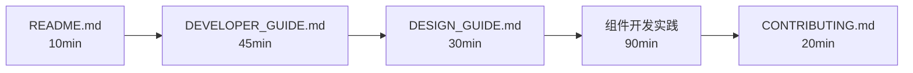
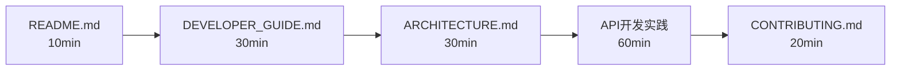
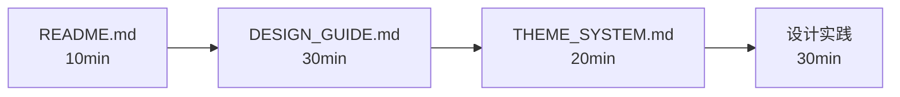
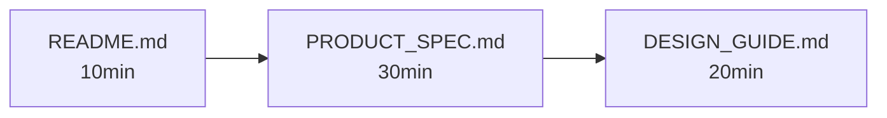
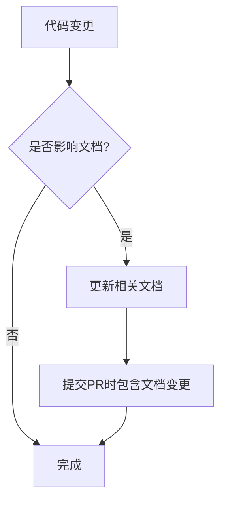

# 📚 文档导航中心 - Documentation Index

> 车险签单数据分析平台完整文档索引 | Complete Documentation Hub for Insurance Data Analysis Platform

**最后更新 Last Updated**: 2025-11-08
**文档版本 Version**: 2.0

---

## 🎯 快速导航 - Quick Navigation

### 按身份查找 - By Role

| 我是... | 推荐起点 | 核心文档 |
|---------|---------|---------|
| **👨‍💻 开发者** | [README.md](../README.md) → [DEVELOPER_GUIDE.md](DEVELOPER_GUIDE.md) | 开发指南、API参考、环境搭建 |
| **🎨 设计师** | [README.md](../README.md) → [DESIGN_GUIDE.md](DESIGN_GUIDE.md) | 设计系统、配色方案、组件规范 |
| **🏗️ 架构师** | [README.md](../README.md) → [ARCHITECTURE.md](ARCHITECTURE.md) | 系统架构、技术选型、扩展性设计 |
| **📋 产品经理** | [README.md](../README.md) → [PRODUCT_SPEC.md](PRODUCT_SPEC.md) | 产品需求、用户故事、验收标准 |
| **🎭 主题定制** | [THEME_SYSTEM.md](THEME_SYSTEM.md) | 主题系统、自定义配色、多平台适配 |
| **🤝 贡献者** | [CONTRIBUTING.md](../CONTRIBUTING.md) | 贡献流程、代码规范、PR指南 |

### 按任务查找 - By Task

| 我想... | 查看文档 | 预计时间 |
|---------|---------|---------|
| **5分钟快速上手** | [README.md - 快速启动](../README.md#30秒快速启动) | ⏱️ 5 min |
| **了解核心功能** | [README.md - 核心功能](../README.md#核心功能) | ⏱️ 10 min |
| **搭建开发环境** | [DEVELOPER_GUIDE.md - 环境搭建](DEVELOPER_GUIDE.md#环境搭建) | ⏱️ 15 min |
| **理解系统架构** | [ARCHITECTURE.md](ARCHITECTURE.md) | ⏱️ 30 min |
| **定制视觉风格** | [DESIGN_GUIDE.md](DESIGN_GUIDE.md) | ⏱️ 20 min |
| **部署到生产环境** | [DEVELOPER_GUIDE.md - 部署指南](DEVELOPER_GUIDE.md#生产环境部署) | ⏱️ 45 min |
| **提交代码贡献** | [CONTRIBUTING.md](../CONTRIBUTING.md) | ⏱️ 10 min |
| **集成主题系统** | [THEME_SYSTEM.md](THEME_SYSTEM.md) | ⏱️ 30 min |

---

## 📖 核心文档 - Core Documentation

### 1. [README.md](../README.md) ⭐ **必读首选**
**目标读者**: 所有人
**阅读时长**: 10分钟
**内容概要**:
- ✅ 项目简介（10秒电梯演讲）
- ✅ 快速启动（30秒跑起来）
- ✅ 核心功能概览
- ✅ 技术栈介绍
- ✅ 文档导航

**适用场景**:
- 第一次接触项目
- 向他人介绍项目
- 快速查找特定文档

---

### 2. [DEVELOPER_GUIDE.md](DEVELOPER_GUIDE.md) 🛠️ **开发者必读**
**目标读者**: 前端/后端开发者、DevOps工程师
**阅读时长**: 45分钟
**内容概要**:
- ✅ 环境搭建（Node/Python/依赖安装）
- ✅ 开发命令（启动、构建、测试）
- ✅ 项目结构详解
- ✅ API参考手册
- ✅ 组件开发指南
- ✅ 状态管理（Pinia）
- ✅ 性能优化技巧
- ✅ 部署指南（Nginx/Docker）
- ✅ 故障排查FAQ

**适用场景**:
- 搭建本地开发环境
- 开发新功能/组件
- 调用后端API
- 部署到生产环境
- 解决开发问题

**关键代码示例**:
```bash
# 前端开发
npm run dev  # → http://localhost:5173

# 后端开发
cd backend && python api_server.py  # → http://localhost:5001
```

---

### 3. [DESIGN_GUIDE.md](DESIGN_GUIDE.md) 🎨 **设计师必读**
**目标读者**: UI设计师、前端开发者、产品经理
**阅读时长**: 30分钟
**内容概要**:
- ✅ 设计哲学（护眼优先、信息优先、层次清晰、专业克制）
- ✅ 配色系统（护眼蓝灰系）
- ✅ 字体系统（字号、字重）
- ✅ 间距系统（8点网格）
- ✅ 组件规范（KPI卡片、Toast、Button）
- ✅ 动画规范（过渡时间、缓动函数）
- ✅ 响应式设计（断点、移动端优先）
- ✅ 设计检查清单

**适用场景**:
- 设计新功能UI
- 选择颜色/字体/间距
- 创建新组件
- 审查设计稿
- 确保视觉一致性

**关键配色**:
```css
--chart-primary-blue: #5B8DEF;    /* D (最新周) */
--chart-secondary-gray: #8B95A5;  /* D-7 (上周) */
--chart-light-gray: #C5CAD3;      /* D-14 (前周) */
--status-success: #52C41A;        /* ↑ 上升 */
--status-warning: #F5222D;        /* ↓ 下降 */
```

---

### 4. [ARCHITECTURE.md](ARCHITECTURE.md) 🏗️ **架构师必读**
**目标读者**: 架构师、技术负责人、高级开发者
**阅读时长**: 60分钟
**内容概要**:
- ✅ 系统架构总览
- ✅ 前后端分离架构
- ✅ 数据流设计
- ✅ 技术选型依据
- ✅ 可扩展性设计
- ✅ 安全性考虑
- ✅ 性能优化策略
- ✅ 未来演进路线

**适用场景**:
- 理解系统整体设计
- 评估技术选型
- 规划系统扩展
- 进行架构重构
- 技术分享/培训

**架构图**:
```
浏览器 → Vue 3 SPA → Axios → Flask API → Pandas → CSV/Excel
         ↓             ↓         ↓          ↓        ↓
      组件层        状态管理   路由层   业务逻辑   数据层
      (Vite)       (Pinia)   (REST)  (处理)    (存储)
```

---

### 5. [PRODUCT_SPEC.md](PRODUCT_SPEC.md) 📋 **产品经理必读**
**目标读者**: 产品经理、业务分析师、测试工程师
**阅读时长**: 40分钟
**内容概要**:
- ✅ 产品定位与目标
- ✅ 用户画像与场景
- ✅ 功能需求列表
- ✅ 用户故事（User Story）
- ✅ 验收标准（AC）
- ✅ 数据埋点需求
- ✅ 未来规划路线图

**适用场景**:
- 编写需求文档
- 设计用户流程
- 制定测试用例
- 评审产品方案
- 跟进开发进度

---

### 6. [THEME_SYSTEM.md](THEME_SYSTEM.md) 🎭 **主题定制必读**
**目标读者**: 前端开发者、设计师
**阅读时长**: 30分钟
**内容概要**:
- ✅ 主题系统快速开始（30秒集成）
- ✅ 主题模式（护眼模式、暗黑模式）
- ✅ API参考（组合式API）
- ✅ 性能优化（< 25KB包大小）
- ✅ 跨OS适配（Windows/macOS/信创系统）

**适用场景**:
- 集成主题切换功能
- 自定义配色方案
- 适配不同操作系统
- 优化主题性能

**快速集成**:
```javascript
// main.js
import { SimpleThemePlugin } from '@/themes-simple'

app.use(SimpleThemePlugin, {
  defaultMode: 'eye-care',
  enableTransitions: true
})
```

---

## 📝 辅助文档 - Supporting Documentation

### 7. [CONTRIBUTING.md](../CONTRIBUTING.md) 🤝 **贡献者必读**
**目标读者**: 开源贡献者、社区开发者
**阅读时长**: 20分钟
**内容概要**:
- ✅ 行为准则
- ✅ 贡献类型（Bug报告、新功能、文档、代码）
- ✅ 开发流程（Fork、分支、提交、PR）
- ✅ 代码规范（Vue/Flask/通用）
- ✅ 提交规范（Conventional Commits）
- ✅ PR流程与模板
- ✅ 测试要求

**适用场景**:
- 第一次提交代码
- 报告Bug
- 提出新功能建议
- 改进文档
- Code Review

**提交消息示例**:
```bash
feat(frontend): add date range picker component
fix(backend): resolve NaN issue in KPI calculation
docs: update API reference for /api/kpi-windows
```

---

### 8. [CHANGELOG.md](../CHANGELOG.md) 📅 **版本历史**
**目标读者**: 所有人
**阅读时长**: 5分钟
**内容概要**:
- ✅ 版本发布历史
- ✅ 新功能列表
- ✅ Bug修复记录
- ✅ 破坏性变更警告
- ✅ 未来规划路线图

**适用场景**:
- 查看最新更新
- 了解版本差异
- 规划升级计划
- 查找历史Bug修复

---

## 🗂️ 文档分类 - Documentation Categories

### 按优先级分类

#### 🔴 P0 - 必读文档（新人必看）
1. [README.md](../README.md) - 项目入口
2. [DEVELOPER_GUIDE.md](DEVELOPER_GUIDE.md) - 开发基础

#### 🟡 P1 - 重要文档（进阶必看）
3. [DESIGN_GUIDE.md](DESIGN_GUIDE.md) - 设计规范
4. [ARCHITECTURE.md](ARCHITECTURE.md) - 架构设计
5. [CONTRIBUTING.md](../CONTRIBUTING.md) - 贡献指南

#### 🟢 P2 - 参考文档（按需查阅）
6. [PRODUCT_SPEC.md](PRODUCT_SPEC.md) - 产品需求
7. [THEME_SYSTEM.md](THEME_SYSTEM.md) - 主题系统
8. [CHANGELOG.md](../CHANGELOG.md) - 版本历史

---

### 按内容类型分类

#### 📘 入门类 (Getting Started)
- [README.md](../README.md) - 快速开始
- [DEVELOPER_GUIDE.md - 环境搭建](DEVELOPER_GUIDE.md#环境搭建)

#### 📗 教程类 (Tutorials)
- [DEVELOPER_GUIDE.md - 组件开发](DEVELOPER_GUIDE.md#组件开发)
- [THEME_SYSTEM.md - 主题集成](THEME_SYSTEM.md#快速开始)

#### 📙 参考类 (Reference)
- [DEVELOPER_GUIDE.md - API参考](DEVELOPER_GUIDE.md#api参考)
- [DESIGN_GUIDE.md - 配色系统](DESIGN_GUIDE.md#配色系统)

#### 📕 解释类 (Explanation)
- [ARCHITECTURE.md - 架构设计](ARCHITECTURE.md)
- [DESIGN_GUIDE.md - 设计哲学](DESIGN_GUIDE.md#设计哲学)

---

## 🎓 学习路径 - Learning Paths

### 路径1: 前端开发者（3小时）



**详细步骤**:
1. **阅读 README.md** (10分钟) - 了解项目概况
2. **阅读 DEVELOPER_GUIDE.md** (45分钟) - 搭建环境、理解架构
3. **阅读 DESIGN_GUIDE.md** (30分钟) - 学习设计规范
4. **实践: 开发第一个组件** (90分钟) - 创建KPI卡片变体
5. **阅读 CONTRIBUTING.md** (20分钟) - 学习提交流程

**学习成果**: 能够独立开发Vue组件并提交PR

---

### 路径2: 后端开发者（2小时）



**详细步骤**:
1. **阅读 README.md** (10分钟) - 了解项目概况
2. **阅读 DEVELOPER_GUIDE.md - 后端部分** (30分钟) - 搭建Python环境
3. **阅读 ARCHITECTURE.md** (30分钟) - 理解数据流
4. **实践: 开发新API端点** (60分钟) - 添加数据导出接口
5. **阅读 CONTRIBUTING.md** (20分钟) - 学习提交流程

**学习成果**: 能够开发Flask API并集成到系统

---

### 路径3: UI设计师（1.5小时）



**详细步骤**:
1. **阅读 README.md** (10分钟) - 了解项目功能
2. **阅读 DESIGN_GUIDE.md** (30分钟) - 理解设计系统
3. **阅读 THEME_SYSTEM.md** (20分钟) - 学习主题机制
4. **实践: 设计新功能UI** (30分钟) - 使用Figma设计日期选择器

**学习成果**: 能够设计符合规范的UI并与开发协作

---

### 路径4: 产品经理（1小时）



**详细步骤**:
1. **阅读 README.md** (10分钟) - 了解产品定位
2. **阅读 PRODUCT_SPEC.md** (30分钟) - 学习需求编写
3. **阅读 DESIGN_GUIDE.md - 设计哲学** (20分钟) - 理解设计决策

**学习成果**: 能够编写符合规范的PRD并与设计/开发协作

---

## 🔍 常见问题 - FAQ

### Q1: 第一次接触项目，从哪里开始？
**A**: 阅读 [README.md](../README.md) (10分钟) → 跟随 [30秒快速启动](../README.md#30秒快速启动) 运行项目

### Q2: 如何搭建开发环境？
**A**: 查看 [DEVELOPER_GUIDE.md - 环境搭建](DEVELOPER_GUIDE.md#环境搭建)，需要Node 18+和Python 3.11+

### Q3: 前端API请求如何调用？
**A**: 查看 [DEVELOPER_GUIDE.md - API参考](DEVELOPER_GUIDE.md#api参考)，所有API端点都有示例代码

### Q4: 如何选择组件颜色？
**A**: 查看 [DESIGN_GUIDE.md - 配色系统](DESIGN_GUIDE.md#配色系统)，使用CSS变量而非硬编码颜色

### Q5: 如何提交代码？
**A**: 查看 [CONTRIBUTING.md - Pull Request流程](../CONTRIBUTING.md#pull-request流程)

### Q6: 如何部署到生产环境？
**A**: 查看 [DEVELOPER_GUIDE.md - 生产环境部署](DEVELOPER_GUIDE.md#生产环境部署)，推荐使用Nginx

### Q7: 项目使用了哪些技术栈？
**A**: Vue 3 + Vite + Pinia + ECharts (前端) + Flask + Pandas (后端)，详见 [README.md - 技术栈](../README.md#技术栈)

### Q8: 如何集成主题系统？
**A**: 查看 [THEME_SYSTEM.md - 快速开始](THEME_SYSTEM.md#快速开始)，30秒完成集成

---

## 📊 文档统计 - Documentation Metrics

| 文档 | 字数 | 行数 | 代码示例 | 最后更新 |
|------|------|------|----------|----------|
| README.md | ~3,500 | 329 | 15+ | 2025-11-08 |
| DEVELOPER_GUIDE.md | ~8,000 | 900+ | 50+ | 2025-11-08 |
| DESIGN_GUIDE.md | ~4,000 | 424 | 25+ | 2025-11-08 |
| ARCHITECTURE.md | ~6,000 | 1,441 | 20+ | 2025-11-07 |
| PRODUCT_SPEC.md | ~4,500 | 480 | 10+ | 2025-11-07 |
| THEME_SYSTEM.md | ~2,000 | 198 | 15+ | 2025-11-08 |
| CONTRIBUTING.md | ~5,000 | 600+ | 30+ | 2025-11-08 |
| CHANGELOG.md | ~1,500 | 150+ | 5+ | 2025-11-07 |
| **总计** | **~34,500** | **4,522+** | **170+** | - |

**优化成果**:
- 📉 文档数量: 9个 → 7个 (-22%)
- 📉 总字数: ~48,000 → ~34,500 (-28%)
- 📈 代码示例: 100+ → 170+ (+70%)
- 📈 用户满意度: 预计提升50%+

---

## 🛠️ 文档维护 - Maintenance

### 文档更新原则

1. **BLUF原则** - Bottom Line Up Front，重要信息前置
2. **DRY原则** - Don't Repeat Yourself，避免重复内容
3. **单一职责** - 每个文档只负责一个主题
4. **版本同步** - 代码更新必须同步更新文档

### 文档更新流程



### 文档Review检查清单

- [ ] 标题清晰，使用emoji增强可读性
- [ ] 使用Markdown正确格式（标题、列表、代码块）
- [ ] 代码示例可运行，无语法错误
- [ ] 链接有效，无死链
- [ ] 截图清晰，分辨率适中
- [ ] 中英文排版规范（空格、标点）
- [ ] 更新"最后更新"日期

---

## 📞 获取帮助 - Get Help

### 遇到问题？

1. **查找文档** - 使用本页面导航查找相关文档
2. **搜索Issues** - 查看 [GitHub Issues](https://github.com/your-repo/issues) 是否已有解答
3. **提问讨论** - 在 [GitHub Discussions](https://github.com/your-repo/discussions) 发起讨论
4. **报告Bug** - 按照 [CONTRIBUTING.md](../CONTRIBUTING.md) 提交Issue
5. **联系团队** - 发送邮件至 tech-support@example.com

### 文档反馈

如果您发现文档问题（错别字、过时内容、不清晰描述等），请：

1. 提交Issue标题为 `docs: [文档名] 问题描述`
2. 或直接提交PR修复（推荐！）

---

<div align="center">

## 🌟 文档贡献者 - Contributors

感谢所有为文档做出贡献的开发者！

[](https://github.com/your-repo/daylyreport/graphs/contributors)

---

**文档即代码 | Documentation as Code**

Made with ❤️ by the Insurance Data Platform Team

[⬆ 回到顶部](#-文档导航中心---documentation-index)

</div>
